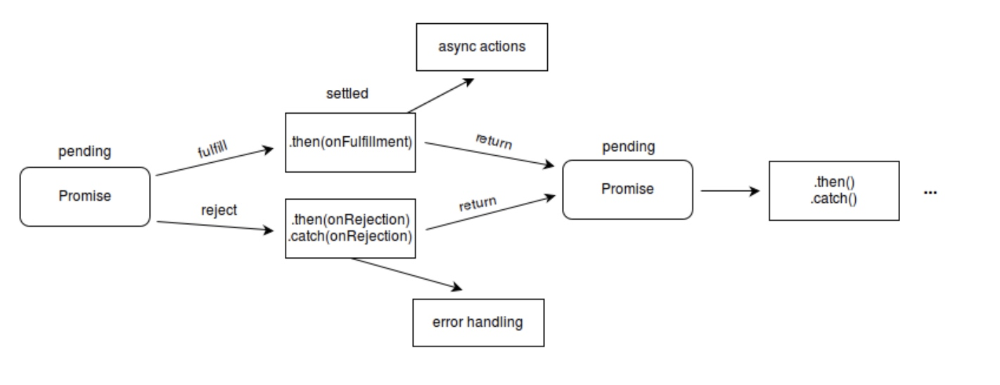
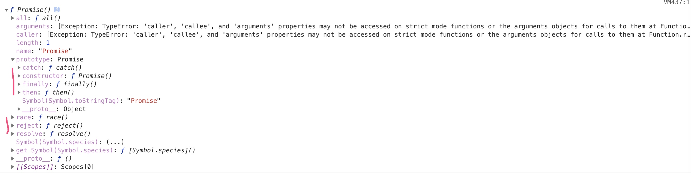

# Promise

**参考link**
[http://es6.ruanyifeng.com/#docs/promise](http://es6.ruanyifeng.com/#docs/promise)
[https://juejin.im/post/5b31a4b7f265da595725f322](https://juejin.im/post/5b31a4b7f265da595725f322)

**question**
- 1、了解 Promise 吗？
- 2、Promise 解决的痛点是什么？
- 3、Promise 解决的痛点还有其他方法可以解决吗？如果有，请列举。
- 4、Promise 如何使用？
- 5、Promise 常用的API有哪些？它们的作用是什么？
- 6、Promise 在事件循环中的执行过程是怎样的？
- 7、Promise 的业界实现都有哪些？
- 8、能不能手写一个 Promise 的 polyfill。
- 9、拓展描述下 `eventloop`, `microtask、macrotask` 的执行顺序
- 10、原生 Promise 是如何实现的？ `callback` 的两个参数，一个是 `resovle`，一个是 `reject`； 链式调用

**回调函数存在的问题**
- 回调嵌套
- 回调执行多次
- 回调没有执行
- 回调有时同步有时异步

**回调地狱的影响**
- 代码臃肿
- 可读性差
- 耦合度过高，可维护性差
- 代码复用性差
- 只能在回调里处理异常
- 。。。

**几种常见的异步解决方案**
- 回调函数
- 事件监听
- 发布订阅
- Promise

Promise用于表示一个异步操作的最终状态（失败|成功）以及其返回的值。

```js
new Promise(function(resolve, reject){})
// 一个Promise 有三个状态 pending fulfilled rejected
```

`Promise.prototype.then` 和  `Promise.prototype.catch` 方法返回`promise` 对象， 所以它们可以被链式调用。


Promise 本质是一个状态机。每个Promise只能是3中状态的一种：pending 、fulfilled、rejected
**状态转变只能是 pending->fulfilled | pending->rejected 状态不可逆**
*_then 方法必须返回一个 Promise_*

Promise 规范有很多，如 Promise/A，Promise/B，Promise/D 以及 Promise/A 的升级版 Promise/A+  最终 ES6 中采用了 Promise/A+ 规范。

Promise是一个*_构造函数_*，需要用 `new` 调用

在控制台中 `console.dir` js的对象属性
我们发现 「Promise 构造函数」有 `all race reject resolve` 方法
`new Promise` 后的「Promise实例」有 `catch finally then` 方法


Promise 理解成 构造函数 还是对象？？？
-----》然后又说 Promise对象是一个构造函数

**优点**
- Promise, 可以将异步操作以同步操作的流程表达出来，避免了层层嵌套的回调函数
- Promise提供了统一的接口，使得控制异步操作容易。

**缺点**
- 无法取消Promise
- 如果不设置回调函数，内部的报错不会反应到外部
- 当处于pending状态，无法知道进行到哪个阶段（刚开始还是即将完成）

> 划笔记啦好学生们

1. ES6规定 Promise 对象是一个构造函数，用来生成 Promise 实例

2. Promise构造函数接收一个函数作为参数，该函数的两个参数分别是 `resolve` `reject`（调用 `resolve` 或 `reject` 并不会终结 `Promise` 的参数函数的执行。）

3. Promise实例生成后，`then`方法可以接受两个回调函数作为参数。第一个回调函数是`Promise`对象的状态变为`resolved`时调用，第二个回调函数是`Promise`对象的状态变为`rejected`时调用。(第二个可选）

4. `Promise` 新建后会立即执行
5. `then` 方法指定的回调函数，会在当前脚本所有同步任务执行完后才会执行
6. `then` 方法返回一个**新**的 `Promise`实例，可以使用**链式**写法
7. `Promise.prototype.catch()`是`.then(null, rejection)`的别名
8. 如果 `Promise` 状态已经变成 `resolved`，再抛出错误是无效的。
9. `Promise` 对象的错误具有“冒泡”性质，会一直向后传递，直到被捕获为止。也就是说，错误总是会被下一个`catch`语句捕获。
10. `Promise.prototype.finally() ` 指定不管 Promise 对象最后状态如何，都会执行的操作
11. `Promise.all`方法用于将多个 `Promise` 实例，包装成一个新的 `Promise` 实例
12. 如果作为参数的 `Promise` 实例，自己定义了 `catch` 方法，那么它一旦被`rejected`，并不会触发 `Promise.all()` 的 `catch` 方法。
13. `Promise.race()` 将多个 `Promise` 实例，包装成一个新的 `Promise` 实例。只要p1、p2、p3之中有一个实例率先改变状态，p的状态就跟着改变。那个率先改变的 `Promise` 实例的返回值，就传递给p的回调函数。
14. 如果希望得到一个 `Promise` 对象，比较方便的方法就是直接调用 `Promise.resolve` 方法。立即`resolve` 的 `Promise` 对象，是在本轮“事件循环”（`event loop`）的结束时，而不是在下一轮“事件循环”的开始时。
15. `Promise.reject()`方法的参数，会原封不动地作为`reject`的理由，变成后续方法的**参数**。
16. 初始化一个 Promise 对象，可以通过两种方式创建， 这两种方式都会返回一个 Promise 对象。`1、new Promise(fn) 2.Promise.resolve(fn)`

```js
// 第7条
p.then((val) => console.log('fulfilled:', val))
  .catch((err) => console.log('rejected', err));

// 等同于
p.then((val) => console.log('fulfilled:', val))
  .then(null, (err) => console.log("rejected:", err));
```

```js
// 第10条
promise
.finally(() => {
  // 语句
});

// 等同于
promise
.then(
  result => {
    // 语句
    return result;
  },
  error => {
    // 语句
    throw error;
  }
);
```

```js
// 第12条
const p1 = new Promise((resolve, reject) => {
  resolve('hello');
})
.then(result => result)
.catch(e => e);

const p2 = new Promise((resolve, reject) => {
  throw new Error('报错了');
})
.then(result => result)
.catch(e => e);

Promise.all([p1, p2])
.then(result => console.log(result))
.catch(e => console.log(e));
// ["hello", Error: 报错了]
```

```js
// 第14条
setTimeout(function () {
  console.log('three');
}, 0);

Promise.resolve().then(function () {
  console.log('two');
});

console.log('one');

// one
// two
// three
```