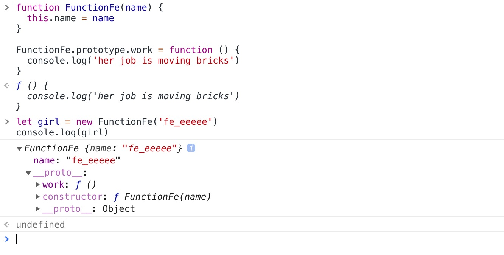
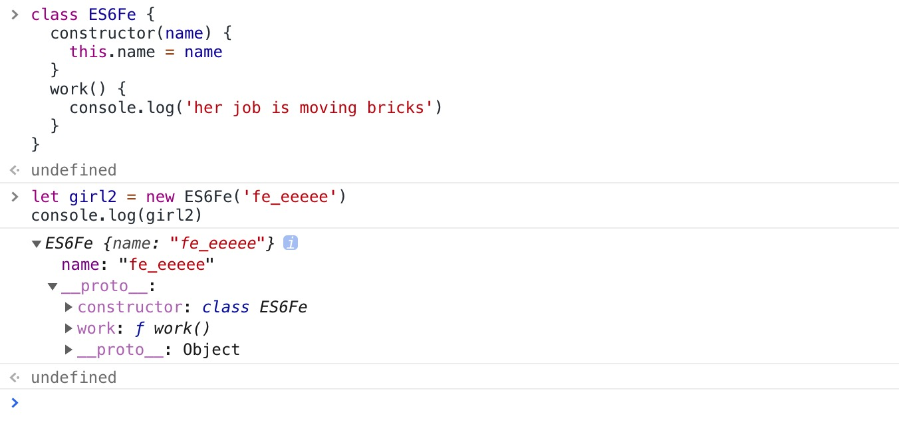
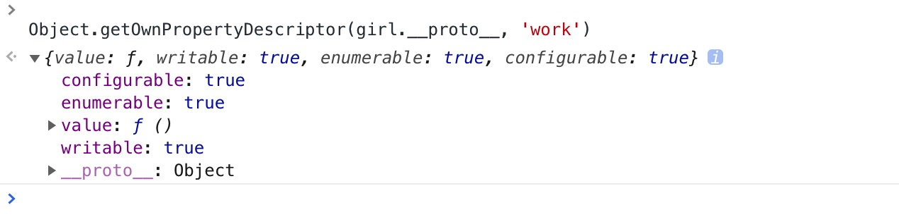
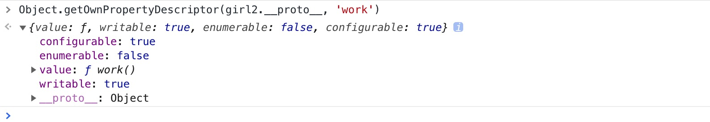

`ES6` 的 `class` 定义的方法和 `ES5` 用 `prototype` 定义的方法有什么不同?

function class:

ES6 class:


两者的区别
在ES6中，`work`方法是**置暗**的; 而在function中，`work`方法是**置亮**的

这个透明度指的是：置暗说明其**不可枚举**；置亮说明其**可枚举**

通过 `Object.getOwnPropertyDescriptor(obj, prop)` 指定对象上「一个自有属性」对应的「属性描述符。」

对于「属性描述符」，可以追溯到`Object.defineProperty()`这个方法，`Object.defineProperty(obj, prop, descriptor)`第三个参数就是属性描述符

function class:

```js
{
  configurable: true,
  enumerable: true, //1
  value: f(), //2
  writable: true
}
```
ES6 class:


```js
{
  configurable: true,
  enumerable: false, //1
  value: f work(), //2
  writable: true
}
```

`enumerable` : 当且仅当该属性的 `enumerable` 为`true`时，该属性才能够出现在对象的枚举属性中。默认为 `false`。

其实仔细一看，还有第2处的差别。 **function 定义的方法没有名称???**

## 如何区别两者

```js
ES6Fe.toString()

/*
"class ES6Fe {
  constructor(name) {
    this.name = name
  }
  work() {
    console.log('her job is moving bricks')
  }
}"
*/

FunctionFe.toString()
/*
"function FunctionFe(name) {
  this.name = name
}"
*/

```

```js
function isES6Class(klass) {
   return klass.toString().startsWith('class')
}
```

相关代码点击 [link](./区别.js)